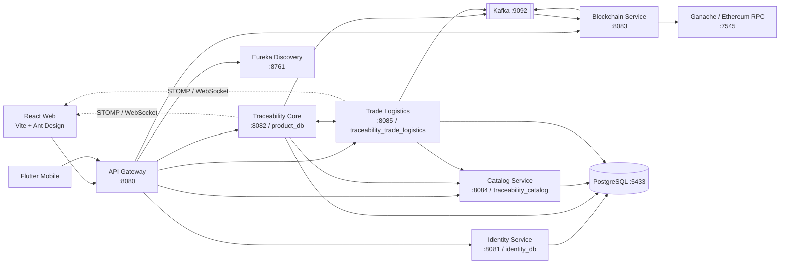
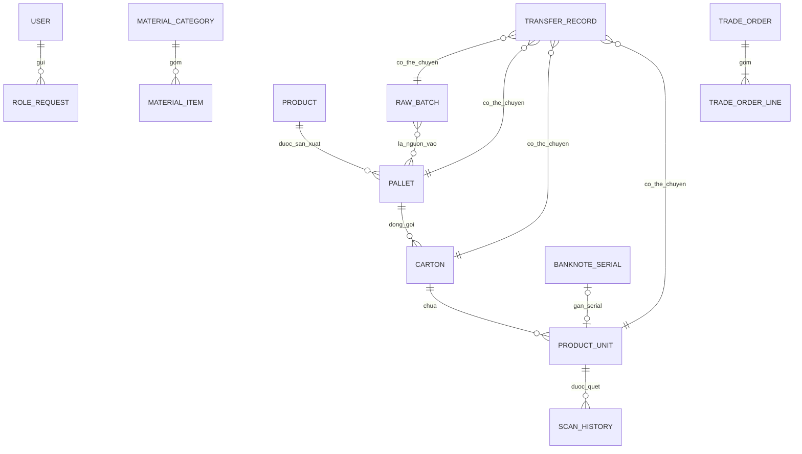
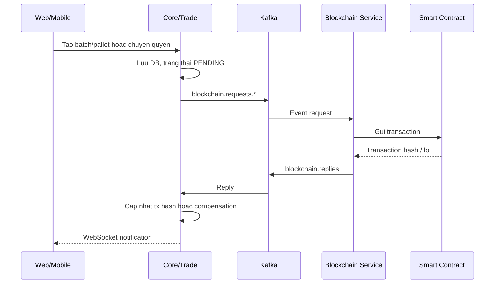

# Tai lieu chuan bi bao cao: He thong truy xuat nguon goc ung dung blockchain

> Ghi chu pham vi: Tai lieu nay duoc doi chieu voi ma nguon nghiep vu va cau hinh
> hien co tai thoi diem 27/05/2026. Cac thu muc sinh tu dong cua Flutter, `target`
> va du lieu volume PostgreSQL khong duoc xem la phan thiet ke nghiep vu.
>
> Luu y: Repository dang co cac thay doi chua commit. Khi chot bao cao can cap
> nhat lai neu kien truc hoac tinh nang tiep tuc thay doi.

## 1. De tai va tom tat

**Ten de tai de xuat:** Xay dung he thong truy xuat nguon goc san pham dua tren
microservices va blockchain.

**Bai toan:** Chuoi cung ung gom nha cung cap nguyen lieu, nha san xuat, nha ban
le, don vi van chuyen va nguoi tieu dung can theo doi duoc lich su san pham,
xac minh du lieu khong bi sua doi trai phep, dong thoi quan ly giao dich va
quyen truy cap theo vai tro.

**Giai phap cua du an:** He thong chia tach thanh cac dich vu Spring Boot, web
React cho nghiep vu quan tri/san xuat/cung cap, ung dung Flutter cho truy xuat
bang QR va cac tac vu di dong, PostgreSQL de luu nghiep vu, Kafka cho xu ly bat
dong bo, WebSocket de thong bao ket qua va smart contract Ethereum/Ganache de
neo hash cung nhu ghi nhan thay doi quyen so huu.

**Gia tri noi bat can trinh bay:**

- Truy nguoc tu don vi san pham den carton, pallet va lo nguyen lieu nguon.
- Tinh lai hash du lieu hien tai va doi chieu voi hash da neo tren blockchain.
- Quan ly don hang theo hai tuyen cung ung va theo doi giao nhan.
- Phan quyen sau vai tro, tach trai nghiem web/mobile theo tac vu thuc te.
- Xu ly ghi blockchain bat dong bo de khong khoa thao tac cua nguoi dung.

## 2. Tac nhan va quyen nang

| Vai tro | Nen tang hien co | Chuc nang chinh |
|---|---|---|
| `USER` | Web va mobile | Dang ky/dang nhap, xem ho so, gui yeu cau nang cap vai tro, quet truy xuat san pham |
| `ADMIN` | Web | Duyet/tu choi yeu cau vai tro; co quyen tren mot so API quan tri/nghiep vu |
| `SUPPLIER` | Web | Quan ly danh muc va lo nguyen lieu, gop lo, tiep nhan don tu nha san xuat, gan van chuyen |
| `MANUFACTURER` | Web va mobile | Mua nguyen lieu, tao san pham, san xuat pallet, dong goi carton/unit, tiep nhan don retailer, dang ky seri bang OCR/barcode |
| `RETAILER` | Mobile | Dat carton thanh pham tu nha san xuat, theo doi trang thai don |
| `TRANSPORTER` | Mobile | Xem don duoc gan, xac nhan da lay hang va da giao hang |

Web hien chu dong chuyen `RETAILER` va `TRANSPORTER` sang thong bao chi dung
mobile. Mobile cho phep `USER`, `MANUFACTURER`, `RETAILER`, `TRANSPORTER`.

## 3. Kien truc tong the

### Danh muc module

| Module | Cong | Trach nhiem | Cong nghe/ket noi quan trong |
|---|---:|---|---|
| `api-gateway` | 8080 | Diem vao, route, CORS, introspect token, circuit breaker | Spring Cloud Gateway MVC, Eureka, Feign, Resilience4j |
| `discovery-server` | 8761 | Dang ky va tim dich vu | Eureka Server |
| `identity-service` | 8081 | Auth, JWT, profile/avatar, directory, yeu cau vai tro | Spring Security, JPA, Cloudinary, `identity_db` |
| `catalog-service` | 8084 | Danh muc nguyen lieu va san pham, QR san pham | JPA, ZXing, Cloudinary, `traceability_catalog` |
| `traceability-core-service` | 8082 | Raw batch, pallet, carton, unit, seri, scan history, public trace/verify | JPA, Flyway, Kafka, WebSocket, `product_db` |
| `trade-logistics-service` | 8085 | Transfer va don hang/giao nhan | JPA, Kafka, WebSocket, `traceability_trade_logistics` |
| `blockchain-service` | 8083 | REST/Kafka adapter sang smart contract, verify hash | Web3j, Ganache, Kafka |
| `common-library` | - | DTO/event/exception/role dung chung | Java library |
| `frontend-web` | Vite | Dashboard theo role | React, Ant Design, React Query, Axios, STOMP |
| `frontend_mobile` | App | Quet QR/OCR, retailer, transporter | Flutter, Bloc, Dio, ML Kit, Secure Storage |
| `infrastructure` | - | Moi truong local | Docker Compose: PostgreSQL, pgAdmin, Redis, Kafka |

### Route qua gateway

| Prefix public-facing | Dich vu dich |
|---|---|
| `/identity/**` | Identity |
| `/product/**` | Traceability Core |
| `/catalog/**` | Catalog |
| `/trade/**` | Trade Logistics |
| `/blockchain/**` | Blockchain |

Gateway cho phep public voi auth endpoints, health, danh muc/san pham doc cong
khai, QR/trace/verify unit va doc ban ghi blockchain. Cac thao tac ghi nghiep vu
yeu cau JWT; service tiep tuc kiem tra role bang `@PreAuthorize`.

## 4. Mo hinh du lieu nghiep vu

### Thuc the chinh

| Nhom | Bang/thuc the | Du lieu chinh |
|---|---|---|
| Dinh danh | `User`, `RoleRequest`, `InvalidatedToken` | Tai khoan, role, profile, blacklist JWT |
| Danh muc | `MaterialCategory`, `MaterialItem`, `Product` | Loai nguyen lieu va san pham cua nha san xuat |
| Truy xuat | `RawBatch` | Lo nguyen lieu, owner, `batchIdHex`, `dataHashHex`, `anchorTxHash` |
| Truy xuat | `Pallet` | Lo thanh pham, product, parent raw batch, hash/tx neo chain |
| Dong goi | `Carton`, `ProductUnit` | Thung va san pham le, serial, owner/status, so lan quet |
| Chong trung serial | `BanknoteSerial` | Seri duoc NSX dang ky, co/khong da gan vao unit |
| Lich su | `ScanHistory` | Lan quet san pham cua nguoi dung dang nhap |
| Thuong mai | `TradeOrder`, `TradeOrderLine` | Don mua nguyen lieu hoac carton, nguoi mua/ban/van chuyen |
| Chuyen quyen | `TransferRecord` | Chuyen owner cho `RAW_BATCH`, `PALLET`, `CARTON`, `UNIT`, ket qua chain |

### Luu y ve tach database

`traceability-core-service` tung chua du lieu don hang/chuyen giao, nhung
migration `V7__drop_trade_orders_and_transfer_records.sql` da loai hai bang
nay khoi `product_db`; quyen so huu va don hang hien thuoc
`trade-logistics-service`. Day la noi dung quan trong khi mo ta qua trinh tach
microservice.

## 5. Cac luong nghiep vu cot loi

### 5.1 Dang ky va cap vai tro

1. Nguoi dung dang ky duoc gan role mac dinh `USER`.
2. Nguoi dung gui yeu cau role `SUPPLIER`, `MANUFACTURER`, `RETAILER` hoac
   `TRANSPORTER`, kem mo ta.
3. Admin duyet hoac tu choi tren web dashboard.
4. Khi duoc duyet, role trong bang user thay doi; nguoi dung can dang nhap lai
   de token moi mang claim role moi.

### 5.2 Nguyen lieu: Supplier den Manufacturer

1. Supplier tao category/item nguyen lieu va tao `RawBatch`.
2. Core chuan hoa payload, bam Keccak-256, luu DB voi tx dang `PENDING`.
3. Core gui event `blockchain.requests.batch`; Blockchain Service goi
   `recordBatch`; reply cap nhat `anchorTxHash` va thong bao WebSocket.
4. Manufacturer tim supplier va tao don `MANUFACTURER_TO_SUPPLIER`, chi duoc
   chon lo dang thuoc supplier do.
5. Supplier chap nhan, co the gan transporter; transporter xac nhan lay/giao,
   hoac supplier giao truc tiep.
6. Khi giao thanh cong, owner cua raw batch chuyen sang manufacturer va
   `OwnershipChanged` duoc ghi tren chain.

### 5.3 San xuat va dong goi

1. Manufacturer tao `Product` trong catalog.
2. Manufacturer chon cac raw batch dang so huu de tao `Pallet`.
3. Pallet duoc bam voi thong tin san xuat va danh sach parent, gui
   `recordTransformedBatch` len smart contract.
4. Manufacturer dang ky seri qua mobile (nhap tay/OCR/barcode); he thong loai
   seri loi/trung va danh dau seri kha dung.
5. Web tao carton/dong goi hang loat; moi `ProductUnit` duoc gan mot seri chua
   su dung va lien ket nguoc toi carton/pallet.

### 5.4 Thanh pham: Manufacturer den Retailer

1. Retailer tren mobile chon manufacturer, san pham va so carton, tao don
   `RETAILER_TO_MANUFACTURER`.
2. Manufacturer kiem tra ton kho, chap nhan don; core giu/danh dau carton qua
   event Kafka.
3. Manufacturer co the gan transporter; transporter xac nhan lay va giao.
4. Khi giao, carton va cac unit lien quan doi owner/trang thai; trade service
   cap nhat don `DELIVERED` va thong bao giao dien.

### 5.5 Nguoi dung quet va xac minh san pham

1. Mobile doc QR/serial cua unit.
2. Core tong hop thong tin product, carton, pallet, raw batch va cac transfer
   da chap nhan thanh timeline.
3. Khi nguoi dung yeu cau verify, Core tinh lai hash raw batch va pallet tu du
   lieu trong DB.
4. Blockchain Service doc hash bat bien trong smart contract va tra ket qua
   trung/khong trung.
5. Mobile hien thi timeline va co `isDataIntact` de canh bao neu raw batch
   hoac pallet khong con khop hash da neo.

## 6. Thiet ke blockchain va xu ly bat dong bo

### Smart contract `Traceability.sol`

| Thanh phan | Y nghia |
|---|---|
| `recordBatch(bytes32, bytes32)` | Ghi hash lo nguyen lieu lan dau |
| `recordTransformedBatch(bytes32, bytes32, bytes32[])` | Ghi hash lo thanh pham va root cua parent |
| `logOwnershipChange(bytes32, string, string)` | Phat event audit chuyen quyen |
| `getBatchRecord`, `getTransformedBatchRecord` | Doc hash de verify |
| `hasBatch`, `hasTransformedBatch` | Kiem tra da neo hay chua |
| `onlySystem` | Chi vi he thong deploy contract duoc ghi |

Du an khong dua toan bo thong tin san pham len blockchain. DB giu noi dung day
du; blockchain giu hash va event audit. Cach nay giam chi phi giao dich va van
cho phep phat hien sua du lieu.

### Event-driven flow

Kafka topics dang dung:

| Topic | Muc dich |
|---|---|
| `blockchain.requests.batch` | Neo raw batch |
| `blockchain.requests.transformed` | Neo pallet/transformed batch |
| `blockchain.requests.ownership` | Ghi chuyen quyen |
| `blockchain.replies` | Ket qua giao dich blockchain |
| `trade.order.events` | Giu/giao carton cho don retailer |
| `trade.inventory.replies` | Ket qua xu ly kho tra ve trade |

## 7. Trang thai quan trong

**Don hang:** `PENDING`, `PROCESSING`, `ACCEPTED`, `REJECTED`, `CANCELLED`,
`ASSIGNED_TO_CARRIER`, `PICKED_UP_FROM_SELLER`, `DELIVERED`, va `ERROR` trong
luong xu ly Kafka.

**Chuyen giao truc tiep:** `PENDING`, `ACCEPTED`, `REJECTED`, kem
`blockchainStatus` nhu `PENDING`, `OK`, `FAILED` hoac `SKIPPED`.

**Hang hoa:** Raw batch dung `NOT_SHIPPED`, `PENDING_SHIPMENT`, `SHIPPED`;
carton/unit dung `IN_STOCK`, `SHIPPING`, `DELIVERED`.

## 8. Cong nghe va ly do lua chon co the trinh bay

| Cong nghe | Vai tro trong du an | Lap luan bao cao |
|---|---|---|
| Spring Boot / Java 17 | Service REST va nghiep vu | He sinh thai tot cho bao mat, persistence, tich hop |
| Spring Cloud Gateway + Eureka | Route va discovery | Tach client khoi dia chi tung service |
| PostgreSQL | Luu du lieu quan he | Phu hop quan he owner, don hang, dong goi |
| Kafka | Xu ly event blockchain/kho | Tach transaction cham khoi HTTP request |
| WebSocket/STOMP | Cap nhat giao dien | Thong bao tx chain va don hang gan thoi gian thuc |
| Solidity + Web3j + Ganache | Lop bang chung hash | Minh hoa tinh bat bien va kha nang doi chieu |
| React + Ant Design | Web nghiep vu | Dashboard/quan tri form va bang du lieu |
| Flutter + Bloc | Mobile | Quet camera, luong van chuyen va retailer tren thiet bi |
| ML Kit / Mobile Scanner | OCR, QR/barcode | Thu thap serial va truy xuat tai hien truong |

## 9. Dan y bao cao de xuat

### Chuong 1. Tong quan de tai

- Ly do chon de tai: minh bach chuoi cung ung va chong sua lich su san pham.
- Muc tieu, pham vi, doi tuong su dung.
- Ket qua mong doi: truy xuat, xac minh, quan ly chuoi giao nhan.

### Chuong 2. Khao sat va phan tich yeu cau

- Mo ta sau actor va use case chinh.
- Yeu cau chuc nang: auth/role, catalog, batch/pallet/packing, order,
  logistics, scan/verify.
- Yeu cau phi chuc nang: phan quyen, tinh toan ven, phan hoi bat dong bo,
  kha nang mo rong dich vu.

### Chuong 3. Thiet ke he thong

- Kien truc microservices va so do trien khai.
- Thiet ke co so du lieu va quan he thuc the.
- API gateway, JWT va RBAC.
- Kafka/WebSocket va trinh tu xu ly.
- Smart contract, payload hash va co che verify.

### Chuong 4. Cai dat

- Backend: tung service va phan chia responsibility.
- Web: dashboard supplier/manufacturer/admin/user.
- Mobile: scan trace, retailer order, transporter, manufacturer serial OCR.
- Infrastructure: PostgreSQL, Kafka, Ganache, Eureka.

### Chuong 5. Thu nghiem va danh gia

- Demo tu raw batch den san pham duoc quet.
- Thu nghiem role va trang thai don hang.
- Thu nghiem neo hash va sua du lieu DB de chung minh verify phat hien sai lech.
- Danh gia ket qua, han che va huong phat trien.

### Chuong 6. Ket luan

- Ket qua dat duoc.
- Dong gop ky thuat.
- Huong hoan thien de san sang production.

## 10. Kich ban demo bao ve de xuat

1. Khoi tao ha tang: PostgreSQL, Kafka, Eureka, cac service, gateway, web va
   app mobile; Ganache co contract da deploy.
2. Dang nhap supplier, tao lo nguyen lieu; cho thay trang thai tx blockchain
   tu `PENDING` sang tx hash bang thong bao WebSocket.
3. Dang nhap manufacturer, tao don mua raw batch; supplier chap nhan va gan
   transporter; transporter tren mobile xac nhan lay/giao.
4. Manufacturer tao product va pallet tu raw batch da nhan; tao carton/unit voi
   seri da dang ky.
5. Retailer tren mobile dat thanh pham; manufacturer chap nhan; transporter
   hoan tat giao hang.
6. Nguoi dung quet QR san pham tren mobile; trinh bay timeline nguon goc.
7. Bam nut verify blockchain de hien thi du lieu toan ven.
8. Neu co moi truong thu nghiem rieng, sua mot truong hash-input trong DB va
   verify lai de minh hoa canh bao khong khop.

**Du lieu/hinh anh nen chuan bi:** so do kien truc, man hinh admin duyet role,
raw batch co tx hash, tao pallet/dong goi, man hinh don retailer/transporter,
ket qua scan timeline va banner verify.

## 11. Cau hoi bao ve va y tra loi ngan

| Cau hoi | Y tra loi |
|---|---|
| Vi sao khong luu toan bo du lieu tren blockchain? | Du lieu day du can truy van/cap nhat hieu qua trong DB; chain chi can luu hash bat bien de doi chieu, giam chi phi va do tre. |
| Blockchain dam bao dieu gi? | Dam bao hash da neo va audit event khong the bi sua tuy y; du lieu DB bi thay doi se cho ket qua verify khong khop. |
| Vi sao dung Kafka? | Giao dich chain cham va co the loi; Kafka cho phep HTTP tra ve nhanh voi trang thai pending, xu ly ket qua sau va thong bao UI. |
| Tai sao tach Core, Catalog va Trade? | Danh muc, du lieu truy xuat/dong goi, va giao dich/logistics co vong doi va tai khac nhau; tach ra de ro ownership va mo rong doc lap. |
| Nguoi dung thuong xac minh the nao? | Quet serial/QR tren mobile, backend dung quan he unit-carton-pallet-raw batch tao timeline va tinh lai hash de so voi smart contract. |
| Role duoc bao ve o dau? | Gateway chan token khong hop le; tung service xac thuc JWT va dung `@PreAuthorize` cho thao tac theo vai tro. |

## 12. Han che va rui ro can trinh bay trung thuc

### Can khac phuc truoc khi dua vao san xuat

- `cloudinary.api_secret`, thong tin database va private key vi Ganache dang nam
  trong file cau hinh. Can doi key va chuyen toan bo secret sang environment
  variable/secret manager.
- Mobile dang gan cung mot URL ngrok trong `ApiClient`; can dung bien moi
  truong theo dev/staging/production.
- Cau hinh hien la moi truong demo local: Ganache, mot broker Kafka va mot
  PostgreSQL; chua phai kien truc san sang van hanh thuc te.

### No ky thuat/diem can kiem thu

- Tai lieu cu `ROLE_ACCESS_MATRIX.md` con su dung ten `product-service`, khong
  phan anh day du viec tach thanh Core/Catalog/Trade.
- Test tu dong trong repository hien chu yeu la smoke test khoi dong ung dung;
  chua thay bo test nghiep vu/bao mat/integration bao phu cac luong quan trong.
- Trong `traceability-core-service`, Flyway bat cung voi Hibernate
  `ddl-auto=update`; can chot chien luoc migration duy nhat khi production.
- Mot so du lieu/trang thai logistics cu trong dump co `SKIPPED` hoac
  `PENDING`; can chon bo du lieu demo sach khi quay video/bao ve.
- Chuoi log/transaction cho order chuyen nhieu raw batch can duoc kiem thu them
  de bao dam moi reply blockchain gan dung don va hien dung tren UI.

## 13. Can cu ma nguon de dan chung trong bao cao

| Noi dung | Tep can doi chieu |
|---|---|
| Gateway route va bao ve request | `backend-services/api-gateway/src/main/resources/application.yml`, `.../filter/AuthenticationFilter.java`, `.../security/PublicRouteMatcher.java` |
| JWT, login/role request | `backend-services/identity-service/src/main/java/vn/edu/kma/identity_service/service/AuthenticationService.java`, `.../service/impl/RoleRequestServiceImpl.java` |
| Raw batch/pallet va hash | `backend-services/traceability-core-service/src/main/java/vn/edu/kma/traceability_core_service/service/impl/RawBatchServiceImpl.java`, `.../PalletServiceImpl.java` |
| Public trace va verify | `backend-services/traceability-core-service/src/main/java/vn/edu/kma/traceability_core_service/service/impl/ProductUnitServiceImpl.java` |
| Don hang va transfer | `backend-services/trade-logistics-service/src/main/java/vn/edu/kma/trade_logistics_service/service/impl/TradeOrderServiceImpl.java`, `.../TransferServiceImpl.java` |
| Kafka reply/WebSocket | `backend-services/traceability-core-service/src/main/java/vn/edu/kma/traceability_core_service/listener/BlockchainReplyListener.java`, `backend-services/trade-logistics-service/src/main/java/vn/edu/kma/trade_logistics_service/listener/BlockchainReplyListener.java` |
| Smart contract | `blockchain-service/src/main/resources/contracts/Traceability.sol` |
| Blockchain adapter | `blockchain-service/src/main/java/vn/edu/kma/blockchain_service/service/impl/TraceabilityServiceImpl.java`, `.../listener/BlockchainMessageListener.java` |
| Web workflows | `frontend-web/src/App.jsx`, `frontend-web/src/pages/manufacture/ManufactureDashboard.jsx`, `frontend-web/src/pages/supplier/SupplierDashboard.jsx` |
| Mobile workflows | `frontend_mobile/lib/main.dart`, `frontend_mobile/lib/features/main/presentation/pages/tabs/scan_tab.dart`, `frontend_mobile/lib/features/retailer/presentation/pages/retailer_orders_tab.dart`, `frontend_mobile/lib/features/transporter/presentation/pages/transporter_orders_tab.dart` |
| Ha tang local | `infrastructure/docker-compose.yml`, `infrastructure/postgres/init/01-init-databases.sql` |

## 14. Viec can lam tiep de hoan thien bao cao

- Chot ten de tai, mau bao cao va gioi han so trang theo yeu cau giang vien.
- Chup anh giao dien theo kich ban demo, ghi lai transaction hash va ket qua
  verify thanh cong/that bai.
- Tao bieu do use case, deployment diagram va sequence diagram ban ve dep tu
  cac so do trong tai lieu nay.
- Bo sung bang test case voi du lieu vao, ket qua mong doi va anh minh chung.
- Neu bao cao phai danh gia an toan, tach mot muc ro rang ve secret management,
  RBAC, JWT blacklist va rui ro moi truong demo.
