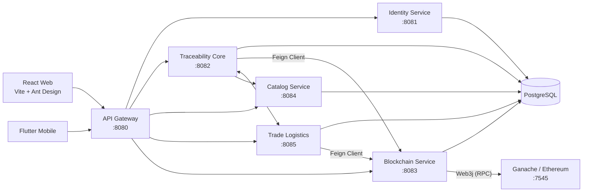

# Tài liệu chuẩn bị báo cáo (Cập nhật V2): Hệ thống truy xuất nguồn gốc ứng dụng Blockchain và Microservices

> **Ghi chú:** Đây là phiên bản tài liệu cập nhật mới nhất phản ánh đúng kiến trúc hiện tại của hệ thống. 
> Các thay đổi lớn so với bản cũ bao gồm: 
> 1) Chuyển đổi giao tiếp Blockchain từ bất đồng bộ (Kafka) sang đồng bộ (REST/Feign Client).
> 2) Bổ sung tính năng theo dõi và thống kê chi phí Gas.
> 3) Loại bỏ hoàn toàn `product-service` cũ, tập trung vào `traceability-core-service` và `catalog-service`.
> 4) Các tính năng mới: đồ thị vòng đời sản phẩm (Batch Graph), đánh giá chất lượng sản phẩm qua QR Code.

## 1. Đề tài và tóm tắt

**Tên đề tài đề xuất:** Xây dựng hệ thống quản lý chuỗi cung ứng và truy xuất nguồn gốc sản phẩm dựa trên kiến trúc Microservices và Blockchain.

**Bài toán:** Chuỗi cung ứng phức tạp cần sự minh bạch. Từ nguyên liệu đến thành phẩm đóng gói carton, pallet và giao đến tay nhà bán lẻ, người tiêu dùng cần biết chắc chắn dữ liệu không bị sửa đổi. Đồng thời, nhà cung cấp và nhà sản xuất cần theo dõi được chi phí giao dịch (Gas) trên nền tảng Blockchain.

**Giải pháp cốt lõi:**
- **Microservices (Spring Boot):** Chia tách các miền nghiệp vụ (Identity, Catalog, Core Traceability, Trade Logistics, Blockchain) để dễ mở rộng.
- **Giao tiếp liên dịch vụ:** Sử dụng OpenFeign cho các lời gọi đồng bộ (VD: ghi lên Blockchain) kết hợp Circuit Breaker (Resilience4j) để đảm bảo an toàn.
- **Blockchain (Solidity/Ganache):** Neo mã băm (Hash) của dữ liệu thay vì lưu toàn bộ dữ liệu, giúp giảm phí Gas nhưng vẫn đảm bảo tính toàn vẹn (Data Integrity). Theo dõi sát sao chi phí Gas cho từng tác nhân (Supplier, Manufacturer).
- **Đa nền tảng:** React Web cho quản trị/nhà sản xuất, Flutter Mobile cho tác vụ hiện trường (Quét QR/OCR, giao nhận).

## 2. Tác nhân và quyền năng

| Vai trò | Nền tảng | Chức năng chính |
|---|---|---|
| `USER` | Web/Mobile | Đăng ký, xem hồ sơ, quét QR truy xuất, **đánh giá sản phẩm (Claim/Review)** |
| `ADMIN` | Web | Duyệt cấp quyền role, xem thống kê Gas tổng hợp toàn hệ thống |
| `SUPPLIER` | Web | Quản lý lô nguyên liệu, tạo đơn giao, **xem báo cáo phí Gas** của mình |
| `MANUFACTURER` | Web/Mobile | Sản xuất (Pallet, Carton), quét OCR seri, tạo sản phẩm, **xem báo cáo phí Gas** |
| `RETAILER` | Mobile | Đặt hàng thành phẩm, theo dõi đơn hàng |
| `TRANSPORTER` | Mobile | Nhận đơn vận chuyển, xác nhận lấy hàng/giao hàng (Không chịu phí Gas) |

## 3. Kiến trúc tổng thể hiện tại

### Các Module chính
- `api-gateway`: Route động (Spring Cloud Gateway), JWT introspection, Circuit Breaker.
- `discovery-server`: Eureka Server để đăng ký dịch vụ.
- `identity-service`: Quản lý tài khoản, RBAC, phân quyền JWT.
- `catalog-service`: Danh mục nguyên liệu, sản phẩm định nghĩa tĩnh.
- `traceability-core-service`: Quản lý Raw Batch, Pallet, Carton, Unit, Serial, Scan History và Đánh giá (Review). Gọi trực tiếp Blockchain qua Feign.
- `trade-logistics-service`: Quản lý luồng chuyển quyền (Transfer) và Đơn hàng. Gọi Blockchain qua Feign.
- `blockchain-service`: Trở thành 1 REST API Server độc lập (không dùng Kafka). Chịu trách nhiệm tương tác Web3j, quản lý `GasUsageController` và lưu trữ DB thống kê Gas (`blockchain_gas_usage`).

## 4. Mô hình dữ liệu cập nhật

Ngoài các bảng nghiệp vụ cơ bản như User, Product, RawBatch, Pallet, Carton, Unit... hệ thống có những sự thay đổi lớn:
1. **Blockchain Gas Ledger (`blockchain_gas_usage`):** Lưu trữ trong DB của Blockchain Service để theo dõi chi phí Gas cho từng request (dựa trên `requestId` để chống trùng lặp), phân bổ phí cho `billing_actor_id` (Supplier/Manufacturer).
2. **Product Review/Claim:** Lưu trữ các đánh giá sản phẩm của người dùng sau khi họ quét QR.

## 5. Các luồng nghiệp vụ cốt lõi

### 5.1 Sản xuất và Ghi nhận Blockchain (Đồng bộ)
1. Manufacturer tạo Pallet từ các lô nguyên liệu (Raw Batch).
2. `traceability-core-service` tạo Pallet trong DB với trạng thái PENDING.
3. Core gọi đồng bộ qua **Feign Client** sang `blockchain-service` (`/api/v1/blockchain/transformed-batch`).
4. `blockchain-service` ghi lên Ganache, chờ Receipt, lưu thông tin vào bảng thống kê Gas, trả về `txHash` và `feeWei`.
5. Core cập nhật `txHash` vào DB và hoàn tất Request.

### 5.2 Người dùng quét QR và Đánh giá sản phẩm
1. Quét QR trên Flutter Mobile. Mobile tải dữ liệu timeline (Graph) của sản phẩm từ Unit -> Carton -> Pallet -> Raw Batch.
2. Mobile tự động so khớp mã Hash trong DB với Smart Contract thông qua API `/verify-hashes` của Blockchain Service.
3. Người dùng xem luồng đồ thị (Batch Graph) trực quan.
4. Người dùng có thể để lại Review/Đánh giá cho sản phẩm ngay trên App.

### 5.3 Thống kê chi phí Gas
1. Supplier/Manufacturer đăng nhập Web, vào menu **Chi phí Blockchain**.
2. Gọi API `/api/v1/gas-usage/my/summary` và `/transactions`.
3. Hệ thống trả về bảng phân tích chi phí bằng Wei (quy đổi hiển thị ra ETH), hiển thị chi tiết số TX thành công/thất bại trên chain.

## 6. Thiết kế Smart Contract

Chỉ có System Wallet mới được ghi dữ liệu, nhưng phí Gas được tính toán và gán logic (Ledger) cho người khởi tạo nghiệp vụ.

Hàm chính:
- `recordBatch(bytes32, bytes32)`: Ghi mã băm lô nguyên liệu.
- `recordTransformedBatch(bytes32, bytes32, bytes32[])`: Ghi mã băm Pallet và mảng các mã băm gốc.
- `logOwnershipChange(bytes32, string, string)`: Ghi log chuyển nhượng.

## 7. Dàn ý báo cáo đề xuất

### Chương 1. Tổng quan đề tài
- Mục tiêu: Minh bạch chuỗi cung ứng, chống giả mạo bằng Blockchain.

### Chương 2. Phân tích thiết kế
- Tách biệt Microservices.
- **Điểm nhấn thiết kế mới:** Tại sao lại chọn REST đồng bộ (Feign) cho Blockchain thay vì Kafka? (Dễ quản lý transaction, phản hồi ngay kết quả Gas fee, dễ xử lý lỗi Exception khi submit).
- Thiết kế Module theo dõi Gas Fee.

### Chương 3. Công nghệ cài đặt
- Spring Boot, Eureka, Gateway, Feign.
- Ganache, Solidity, Web3j.
- React, Flutter.

### Chương 4. Đánh giá và Thực nghiệm
- Demo luồng chuỗi cung ứng.
- Đồ thị lô hàng (Batch Graph).
- Thống kê Gas Dashboard.
- Cảnh báo sai lệch dữ liệu (Data Intact = false).

## 8. Kịch bản Demo bảo vệ

1. **Khởi tạo:** Chạy các Services, Ganache, Gateway, Mobile.
2. **Luồng nghiệp vụ:** Supplier tạo lô nguyên liệu -> Manufacturer mua lô nguyên liệu, đóng Pallet, Carton -> Retailer đặt hàng.
3. **Thống kê Gas:** Mở màn hình Supplier/Manufacturer để show hội đồng xem các giao dịch vừa thực hiện đã tiêu tốn bao nhiêu Gas, quy đổi ra ETH.
4. **Truy xuất & Đánh giá:** Dùng Mobile quét QR 1 hộp sản phẩm (Unit). Show đồ thị truy xuất (Graph). Đóng giả người dùng viết 1 đánh giá (Review).
5. **Data Tampering (Sửa dữ liệu):** Sửa trực tiếp DB PostgreSQL để làm sai mã băm. Quét lại QR để show màn hình cảnh báo "Dữ liệu đã bị thay đổi".

## 9. Câu hỏi bảo vệ dự kiến

| Câu hỏi | Gợi ý trả lời |
|---|---|
| Tại sao không dùng Kafka cho Blockchain nữa mà lại dùng Feign? | Giao tiếp REST giúp nhận ngay kết quả Receipt (txHash, Gas used) từ mạng lưới để báo lỗi ngay cho người dùng nếu thất bại, giúp tính toán và lưu hóa đơn Gas (Ledger) nhất quán hơn. |
| Người dùng trả phí Gas bằng cách nào? | Trên thực tế, hệ thống (System Wallet) đứng ra trả phí để đơn giản hóa UX, còn tính năng Thống kê Gas đóng vai trò như một hệ thống "Billing/Ledger" nội bộ để đối soát tài chính cuối tháng với Supplier/Manufacturer. |
| Nếu Blockchain Service bị sập, dữ liệu có bị mất không? | Circuit Breaker sẽ kích hoạt, Gateway/Core service sẽ chặn tác vụ ghi và trả về lỗi cho người dùng thay vì treo hệ thống. Dữ liệu chưa ghi lên chain sẽ không được lưu vào DB Core. |

## 10. Hạn chế & Nợ kỹ thuật cần lưu ý
- Vẫn còn một số cấu hình Hardcode mật khẩu/Key trong `application.yml`.
- Nên triển khai thử nghiệm trên 1 Testnet thực tế (như Sepolia) thay vì chỉ dùng Ganache (Local) nếu muốn ghi điểm cao hơn.
